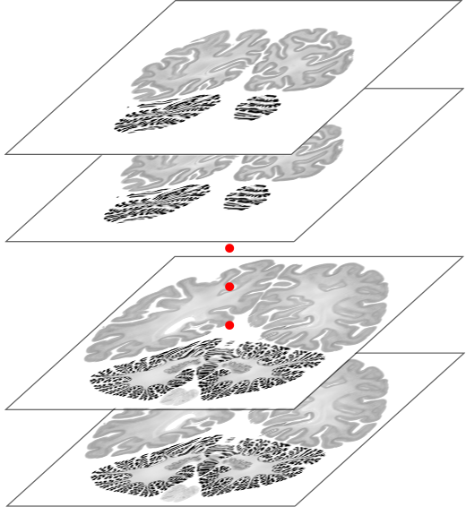
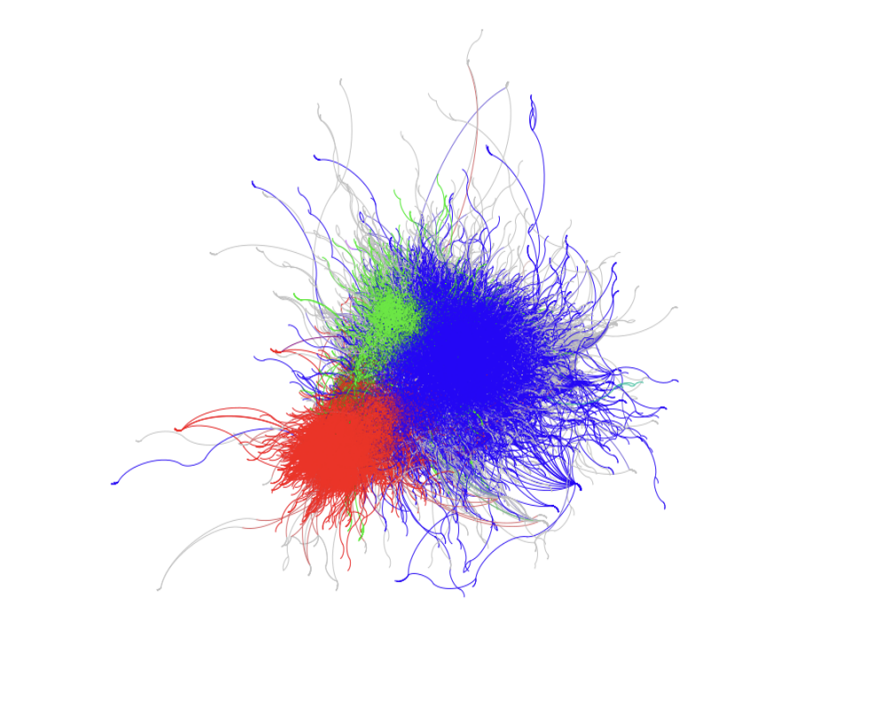

# My portfolio

Hello, I'm Yannick! I recently completed dual Bachelor's degrees in Computer Science and Social Science. Throughout my academic journey, I've specialized in collecting and analyzing various types of data. This portfolio aims to showcase some of the projects I've worked on in the past, providing an overview of my expertise for anyone interested in my work. If you have any further questions or would like to get in touch, please don't hesitate to contact me via GitHub or my [university email](lazel102@hhu.de).

## Project 1 : Image Registration of the Brain

In collaboration with a fellow student, we are working on a university project that involves performing image registration on a collection of unregistered brain images. These images are provided by the  [Big Data Analytics research group] (https://www.fz-juelich.de/en/inm/inm-1/research/big-data-analytics) at the[Institute of Neurosciences and Medicine (INM)](https://www.fz-juelich.de/en) in Jülich, Germany. Our goal is to apply the methods learned from the Computer Vision lecture within the  [Master Artificial Intelligence & Data Sciene](https://www.heicad.hhu.de/lehre/masters-programme-ai-and-data-science) to align these images with each other.  By doing so, we hope to create a comprehensive 3D representation of the original brain structure.

[Take me to this Project](https://git.hhu.de/2023-computer-vision-lazel102-lusch224/project-1-image-registration/)

## Project 2 : SciTok - A Web Scraping Tool for Social Science Research

For my bachelor's thesis in Computer Science, I created SciTok, a specialized tool designed for researchers to scrape and integrate TikTok data into theoretical models. Despite its widespread usage and growing interest among social scientists, TikTok currently does not provide a means for researchers to access and analyze its data.

SciTok bridges this gap by allowing social scientists to collect and analyze TikTok data efficiently. The tool has been specifically tailored to meet the needs of social scientists, with a strong focus on facilitating social network analysis. Throughout the development process of the initial prototype, emphasis was placed on ensuring the tool's accessibility for scientists without a background in computer science, as well as addressing legal and ethical concerns related to social media data analysis.

[Take me to this Project](https://github.com/Lazel102/SciTok)

[Take me to the Thesis](https://www.researchgate.net/publication/368575971_Bachelor_Thesis_for_a_Degree_in_Computer_Science_Let's_Talk_about_TikTok_-_A_Web_Scraping_Tool_for_Social_Science_Research)

## Project 3 : Twitter Analysis of the Vaccaniation Discussion during the Corona Pandemie

For my bachelor's thesis in Social Science, I conducted a large-scale Twitter analysis focusing on the discourse surrounding vaccinations. By utilizing a sample of over 3 million tweets, I applied a graph clustering algorithm to identify both vaccination advocates and skeptics. This enabled a comparative analysis of the respective discourses, shedding light on the contrasting perspectives within the ongoing vaccination debate.

[Take me to the Thesis](https://drive.google.com/file/d/1s1cCiayxffLNuFTxQtf16mLpHvrQ-U8x/view?usp=sharing)

## Project 4 : Les Elfes De Maison 

Together with a close friend, who I currently share a residence with in Paris, we identified a common issue among young people living in the city: the lack of adequate cooking space due to the typically small kitchens in apartments. To address this problem, we established a project that aims to connect individuals with spacious kitchens seeking social interaction, and those who desire a suitable kitchen for cooking. Les Elfes De Maison is a website that allows users to create and find batch cooking events, fostering a sense of community and shared culinary experiences.

[Take me to this Project](https://github.com/Lazel102/Les_elfes_de_maison)

